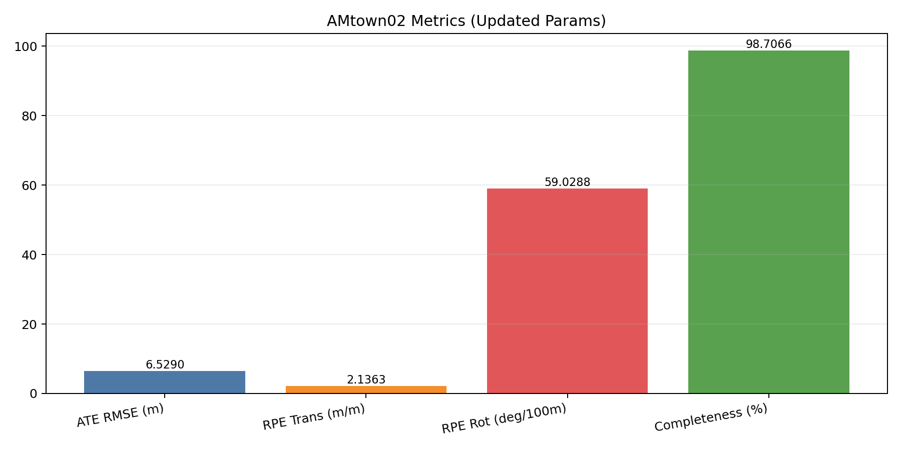
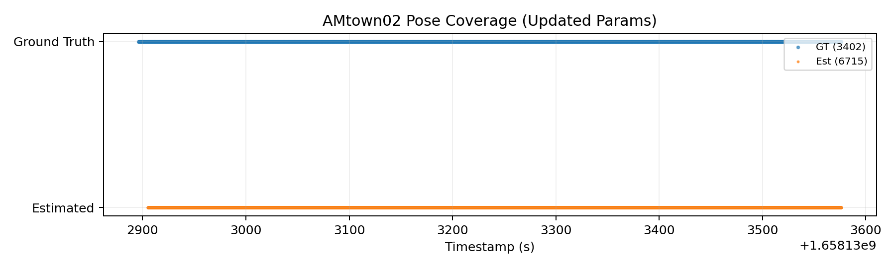
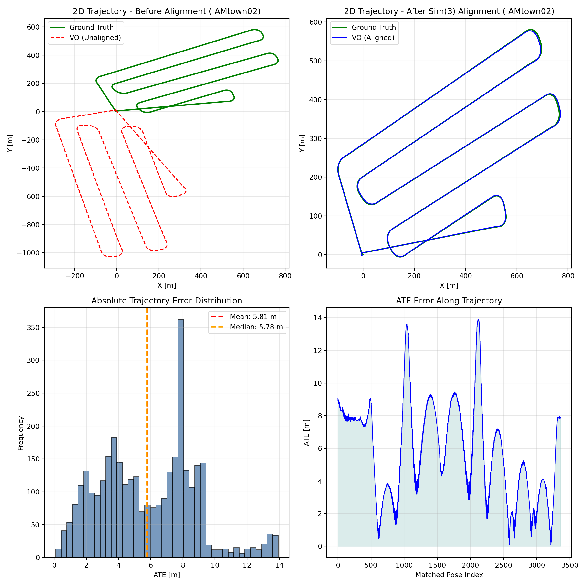

# AAE5303 Assignment 2: Groupwork Part 1 (ORB-SLAM3 VO)

## Executive Summary

This repository packages the **Part 1 VO result** on AMtown02 in assignment-style format, including:

- final leaderboard metrics
- parameter configuration and optimization notes
- visualization figures used for report presentation

The Part 1 output trajectory (`CameraTrajectory.txt`) is the direct input to Part 2 (3DGS/OpenSplat).

## Key Results (AMtown02)

| Metric | Value | Description |
|--------|-------|-------------|
| **ATE RMSE** | **6.5290 m** | Global error after Sim(3) + scale correction |
| **RPE Trans Drift** | **2.1363 m/m** | Translation drift rate |
| **RPE Rot Drift** | **59.0288 deg/100m** | Rotation drift rate |
| **Completeness** | **98.71%** | Matched poses / GT poses |

Result files:

- `output/PART1_AMtown02_results.md`
- `output/evaluation_report.json`
- `leaderboard/JinZhengzhen_leaderboard.json`

## Implementation Parameters

Main config file:

- `configs/amtown_mono_groupwork.yaml`

### Camera Parameters

| Parameter | Value |
|-----------|-------|
| `Camera.type` | `PinHole` |
| `Camera1.fx` | `1444.43` |
| `Camera1.fy` | `1444.34` |
| `Camera1.cx` | `1179.50` |
| `Camera1.cy` | `1044.90` |
| `Camera.width` | `2448` |
| `Camera.height` | `2048` |
| `Camera.newWidth` | `1224` |
| `Camera.newHeight` | `1024` |
| `Camera.fps` | `10` |
| `Camera.RGB` | `0` |
| `Camera.imageScale` | `1.0` |

### ORB Extractor Parameters

| Parameter | Value |
|-----------|-------|
| `ORBextractor.nFeatures` | `1500` |
| `ORBextractor.scaleFactor` | `1.3` |
| `ORBextractor.nLevels` | `10` |
| `ORBextractor.iniThFAST` | `22` |
| `ORBextractor.minThFAST` | `11` |

### Initialization Parameters

| Parameter | Value |
|-----------|-------|
| `Initializer.minParallax` | `1.0` |
| `Initializer.minTriangulated` | `50` |

### Parameter Change Note

`Camera.imageScale: 1.0` is explicitly added for groupwork documentation consistency.
The current README metrics are from the updated parameter run and were re-evaluated after applying this full parameter set.

For full rationale:

- `docs/PARAMETER_OPTIMIZATION.md`

## Visualizations

### A) Leaderboard Metrics Card

### B) Pose Coverage (Timestamp Domain)

### C) Trajectory Geometry (Qualitative)

## Part 1 to Part 2 Handoff

This repository is Part 1 only, but its output is directly used by Part 2:

- Part 1 provides camera poses (`CameraTrajectory.txt`)
- Part 2 (OpenSplat) consumes poses + images to reconstruct 3D scene

That is the core technical linkage between assignment sections.
